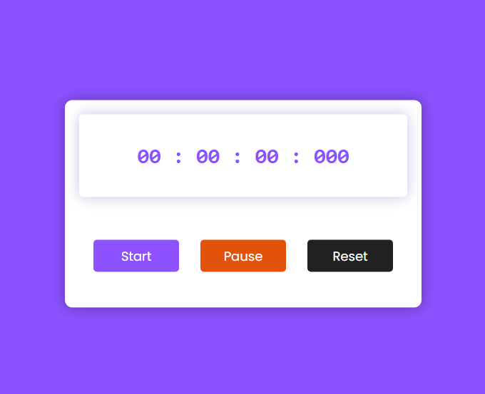

# Timer (Contador)

Este é um projeto simples de um timer desenvolvido com HTML, CSS e JavaScript.

## Como usar

1. Faça o download ou clone este repositório.
2. Abra o arquivo `index.html` em seu navegador da web.
3. Use os botões "Iniciar", "Pausar" e "Zerar" para controlar o timer.

## Recursos

- Iniciar: Inicia o timer.
- Pausar: Pausa o timer.
- Zerar: Zera o timer.
